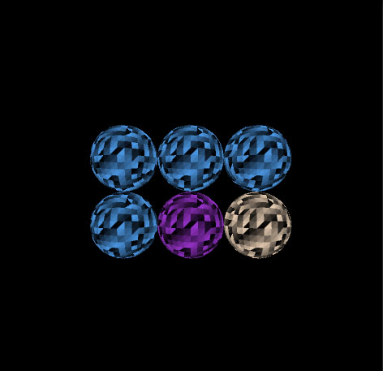

#セマンティクスのテスト

- SV_VertexID VertexShaderで、頂点IDが取得できる
- SV_InstanceID VertexIDで、インスタンス描写した時のインスタンス毎のIDが取得できる
- SV_PrimitiveID triangleとか、point/line/quadなど、プリミティブ毎のIDが取得できる(Geometry/Fragment)

https://msdn.microsoft.com/ja-jp/library/bb509647(v=vs.85).aspx

